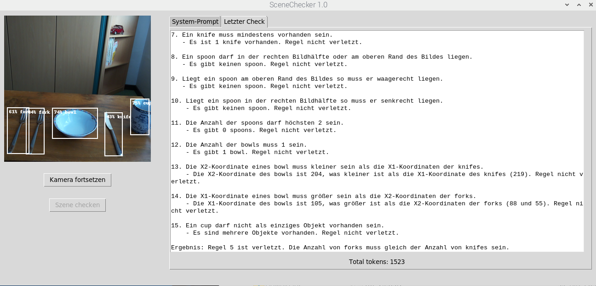

# Beispiel: Ein Messer fehlt

 ## User-prompt und Ergebnis der Überprüfung
Liste 1:  
cup, (275,182,316,261), senkrecht.  
bowl, (105,202,204,269), waagerecht.  
fork, (48,202,88,303), senkrecht.  
fork, (7,201,55,302), senkrecht.  
knife, (219,212,258,307), senkrecht.

Liste 2:  
fork: 2.  
knife: 1.  
cup: 1.  
spoon: 0.  
bowl: 1.  

Überprüfung läuft....
Lassen Sie uns die Eingabe anhand der Regeln überprüfen:

1. Ein knife darf nur in der rechten Bildhälfte liegen.
   - Das knife befindet sich bei X1 = 219, was in der rechten Bildhälfte liegt. Regel nicht verletzt.

2. Eine fork darf nur in der linken Bildhälfte liegen.
   - Beide forks befinden sich bei X1 = 48 und X1 = 7, was in der linken Bildhälfte liegt. Regel nicht verletzt.

3. Die Ausrichtung eines knife muss senkrecht sein.
   - Das knife ist senkrecht ausgerichtet. Regel nicht verletzt.

4. Die Ausrichtung einer fork muss senkrecht sein.
   - Beide forks sind senkrecht ausgerichtet. Regel nicht verletzt.

5. Die Anzahl von forks muss gleich der Anzahl von knifes sein.
   - Es gibt 2 forks und 1 knife. Regel verletzt.

6. Eine fork muss mindestens vorhanden sein.
   - Es sind 2 forks vorhanden. Regel nicht verletzt.

7. Ein knife muss mindestens vorhanden sein.
   - Es ist 1 knife vorhanden. Regel nicht verletzt.

8. Ein spoon darf in der rechten Bildhälfte oder am oberen Rand des Bildes liegen.
   - Es gibt keinen spoon. Regel nicht verletzt.

9. Liegt ein spoon am oberen Rand des Bildes so muss er waagerecht liegen.
   - Es gibt keinen spoon. Regel nicht verletzt.

10. Liegt ein spoon in der rechten Bildhälfte so muss er senkrecht liegen.
    - Es gibt keinen spoon. Regel nicht verletzt.

11. Die Anzahl der spoons darf höchsten 2 sein.
    - Es gibt 0 spoons. Regel nicht verletzt.

12. Die Anzahl der bowls muss 1 sein.
    - Es gibt 1 bowl. Regel nicht verletzt.

13. Die X2-Koordinate eines bowl muss kleiner sein als die X1-Koordinaten der knifes.
    - Die X2-Koordinate des bowls ist 204, was kleiner ist als die X1-Koordinate des knifes (219). Regel nicht verletzt.

14. Die X1-Koordinate eines bowl muss größer sein als die X2-Koordinaten der forks.
    - Die X1-Koordinate des bowls ist 105, was größer ist als die X2-Koordinaten der forks (88 und 55). Regel nicht verletzt.

15. Ein cup darf nicht als einziges Objekt vorhanden sein.
    - Es sind mehrere Objekte vorhanden. Regel nicht verletzt.

Ergebnis: Regel 5 ist verletzt. Die Anzahl von forks muss gleich der Anzahl von knifes sein.
