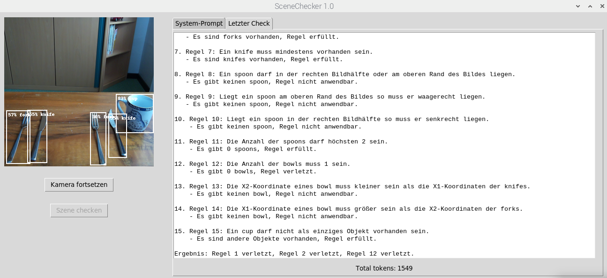

# Beispiel: Bild mit 3 Fehlern

 ## User-prompt und Ergebnis der Überprüfung
Liste 1:
cup, (239,165,319,248), neutral.  
fork, (5,200,56,314), senkrecht.  
knife, (223,207,262,301), senkrecht.  
knife, (50,199,92,312), senkrecht.  
fork, (184,204,218,317), senkrecht.  

Liste 2:  
fork: 2.  
knife: 2.  
cup: 1.  
spoon: 0.  
bowl: 0.  

Überprüfung läuft....
1. Regel 1: Ein knife darf nur in der rechten Bildhälfte liegen.
   - Das erste knife liegt in der rechten Bildhälfte (X1 = 223), Regel erfüllt.
   - Das zweite knife liegt in der linken Bildhälfte (X1 = 50), Regel verletzt.

2. Regel 2: Eine fork darf nur in der linken Bildhälfte liegen.
   - Die erste fork liegt in der linken Bildhälfte (X1 = 5), Regel erfüllt.
   - Die zweite fork liegt in der rechten Bildhälfte (X1 = 184), Regel verletzt.

3. Regel 3: Die Ausrichtung eines knife muss senkrecht sein.
   - Beide knifes sind senkrecht ausgerichtet, Regel erfüllt.

4. Regel 4: Die Ausrichtung einer fork muss senkrecht sein.
   - Beide forks sind senkrecht ausgerichtet, Regel erfüllt.

5. Regel 5: Die Anzahl von forks muss gleich der Anzahl von knifes sein.
   - Es gibt 2 forks und 2 knifes, Regel erfüllt.

6. Regel 6: Eine fork muss mindestens vorhanden sein.
   - Es sind forks vorhanden, Regel erfüllt.

7. Regel 7: Ein knife muss mindestens vorhanden sein.
   - Es sind knifes vorhanden, Regel erfüllt.

8. Regel 8: Ein spoon darf in der rechten Bildhälfte oder am oberen Rand des Bildes liegen.
   - Es gibt keinen spoon, Regel nicht anwendbar.

9. Regel 9: Liegt ein spoon am oberen Rand des Bildes so muss er waagerecht liegen.
   - Es gibt keinen spoon, Regel nicht anwendbar.

10. Regel 10: Liegt ein spoon in der rechten Bildhälfte so muss er senkrecht liegen.
    - Es gibt keinen spoon, Regel nicht anwendbar.

11. Regel 11: Die Anzahl der spoons darf höchsten 2 sein.
    - Es gibt 0 spoons, Regel erfüllt.

12. Regel 12: Die Anzahl der bowls muss 1 sein.
    - Es gibt 0 bowls, Regel verletzt.

13. Regel 13: Die X2-Koordinate eines bowl muss kleiner sein als die X1-Koordinaten der knifes.
    - Es gibt keinen bowl, Regel nicht anwendbar.

14. Regel 14: Die X1-Koordinate eines bowl muss größer sein als die X2-Koordinaten der forks.
    - Es gibt keinen bowl, Regel nicht anwendbar.

15. Regel 15: Ein cup darf nicht als einziges Objekt vorhanden sein.
    - Es sind andere Objekte vorhanden, Regel erfüllt.

Ergebnis: Regel 1 verletzt, Regel 2 verletzt, Regel 12 verletzt.
