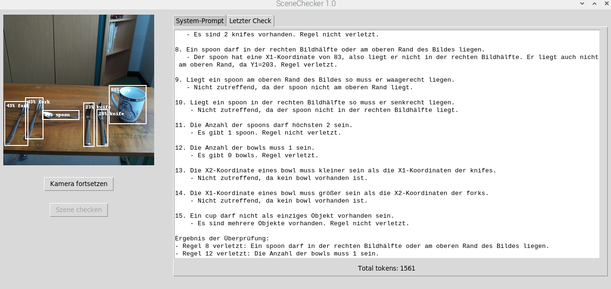

# Beispiel: Ein Spoon liegt falsch, ein Bowl fehlt

 ## User-prompt und Ergebnis der Überprüfung
Liste 1:  
cup, (224,150,303,232), neutral.  
fork, (3,184,53,278), senkrecht.  
fork, (47,176,85,264), senkrecht.  
spoon, (83,203,161,223), waagerecht.  
knife, (198,201,222,279), senkrecht.  
knife, (170,187,193,280), senkrecht.  

Liste 2:  
fork: 2.  
knife: 2.  
cup: 1.  
spoon: 1.  
bowl: 0.

Überprüfung läuft....
Ich werde die Eingabe anhand der Regeln überprüfen:

1. Ein knife darf nur in der rechten Bildhälfte liegen.
   - Beide knifes haben X1-Koordinaten größer als 160, also in der rechten Bildhälfte. Regel nicht verletzt.

2. Eine fork darf nur in der linken Bildhälfte liegen.
   - Beide forks haben X1-Koordinaten kleiner oder gleich 160, also in der linken Bildhälfte. Regel nicht verletzt.

3. Die Ausrichtung eines knife muss senkrecht sein.
   - Beide knifes sind senkrecht ausgerichtet. Regel nicht verletzt.

4. Die Ausrichtung einer fork muss senkrecht sein.
   - Beide forks sind senkrecht ausgerichtet. Regel nicht verletzt.

5. Die Anzahl von forks muss gleich der Anzahl von knifes sein.
   - Es gibt 2 forks und 2 knifes. Regel nicht verletzt.

6. Eine fork muss mindestens vorhanden sein.
   - Es sind 2 forks vorhanden. Regel nicht verletzt.

7. Ein knife muss mindestens vorhanden sein.
   - Es sind 2 knifes vorhanden. Regel nicht verletzt.

8. Ein spoon darf in der rechten Bildhälfte oder am oberen Rand des Bildes liegen.
   - Der spoon hat eine X1-Koordinate von 83, also liegt er nicht in der rechten Bildhälfte. Er liegt auch nicht am oberen Rand, da Y1=203. Regel verletzt.

9. Liegt ein spoon am oberen Rand des Bildes so muss er waagerecht liegen.
   - Nicht zutreffend, da der spoon nicht am oberen Rand liegt.

10. Liegt ein spoon in der rechten Bildhälfte so muss er senkrecht liegen.
    - Nicht zutreffend, da der spoon nicht in der rechten Bildhälfte liegt.

11. Die Anzahl der spoons darf höchsten 2 sein.
    - Es gibt 1 spoon. Regel nicht verletzt.

12. Die Anzahl der bowls muss 1 sein.
    - Es gibt 0 bowls. Regel verletzt.

13. Die X2-Koordinate eines bowl muss kleiner sein als die X1-Koordinaten der knifes.
    - Nicht zutreffend, da kein bowl vorhanden ist.

14. Die X1-Koordinate eines bowl muss größer sein als die X2-Koordinaten der forks.
    - Nicht zutreffend, da kein bowl vorhanden ist.

15. Ein cup darf nicht als einziges Objekt vorhanden sein.
    - Es sind mehrere Objekte vorhanden. Regel nicht verletzt.

Ergebnis der Überprüfung:
- Regel 8 verletzt: Ein spoon darf in der rechten Bildhälfte oder am oberen Rand des Bildes liegen.
- Regel 12 verletzt: Die Anzahl der bowls muss 1 sein.

