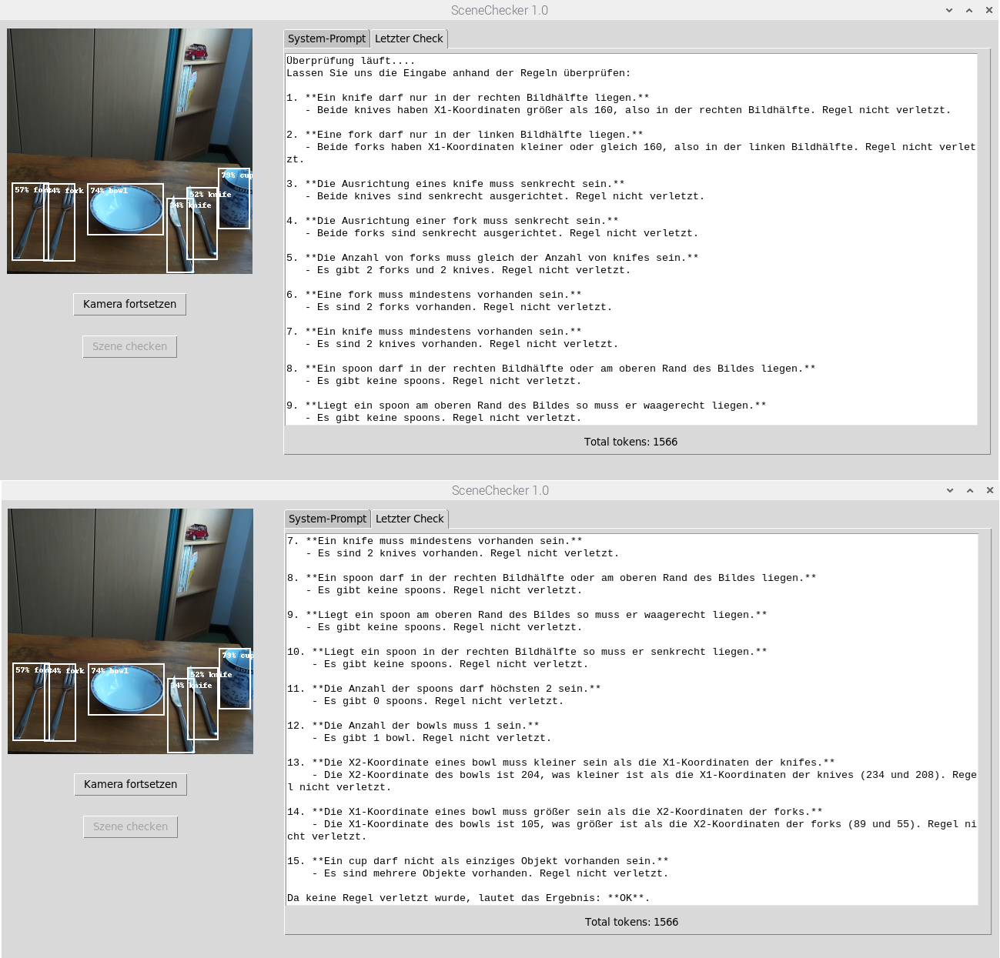

# SceneChecker
Überprüfung von Bildszenen mit Hilfe der Objekterkennung und dem OpenAI GPT Chat Completions API auf dem Raspberry Pi.
Der SceneChecker überprüft als Beispiel mit 15 Regeln den richtigen Aufbau eines Gedecks.

Stellen wir uns folgende Situation vor. Auszubildende der Hotelfachschule sollen lernen, wie man eine Gedeck richtig auf einen Tisch anordnet.
Wo kommen das oder die Messer und Gabeln hin, wo ein Bowl und wo eine Tasse? Ist die Anzahl der Gabeln richtig? Fehlt ein Messer oder eine Becher?

Ein Überprüfung einer derartigen Szene macht ein kundiger Ausbilder in Sekunden. Wenn er aber nicht da ist, könnte ein Raspberry Pi die Aufgabe übernehmen. 
Die Auszubildenden könnten dann selbst lernen. Doch wie überprüfen wir die richtige Anordnung der Objekte?
Man könnte ein Regelwerk in Python programmieren. Doch das ist sehr aufwendig und bei Änderungen der Regeln muss ein Programmierer vor Ort sein. 

Das Projekt zeigt, wie man die Regeln so definiert, das sie mit dem OpenAI GPT Chat Completions API überprüft werden können. Das API liefert eine Auswertung
mit eventuellen Regelverletzungen. Die Regeln werden mit Hilfe des System-Prompts in Form eines "Mega-Prompts" definiert.
Der System-Prompt kann geaändert werden, um auch andere Szenen zu überprüfen.  
